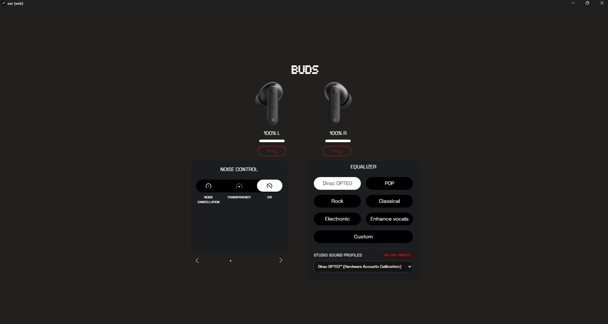
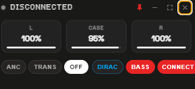
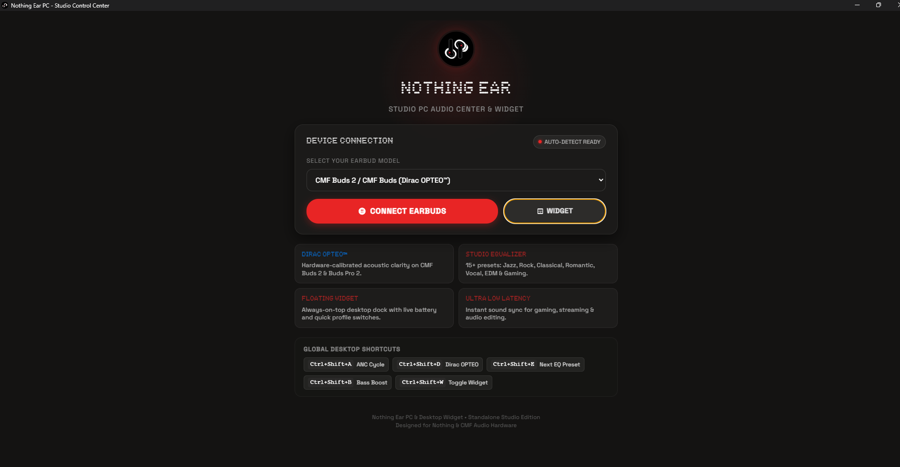

# Nothing Ear PC & Desktop Widget (Studio Edition)

<div align="center">
  
  <h3>Standalone PC Control Suite & Floating Desktop Widget for Nothing & CMF Earbuds</h3>

  <p>
    
    
    
    
    
  </p>
</div>

> ⚠️ **Nightly / Test Version**: This is an active preview build. Features and hardware DSP curves are being tested across different Windows configurations and earbud models. Feedback and bug reports are welcome!

---

## 📖 Overview

**Nothing Ear PC** is a high-performance standalone Windows desktop application and floating desktop widget built for **Nothing** and **CMF by Nothing** earbuds. It delivers hardware-level control over Bluetooth RFCOMM / SPP, featuring **Dirac OPTEO™** hardware calibration, an **Inbuilt Studio Equalizer Engine** with 15+ curated DSP sound curves, ultra-low latency audio management, and global Windows keyboard shortcuts.

---

## 📸 App Preview

<div align="center">
  <p><b>Studio Audio Dashboard with Dirac OPTEO™ & CMF Buds Detection</b></p>
  
  <br/><br/>
  <p><b>Floating Desktop Acrylic Widget (with Battery Gauges & Dirac Pill)</b></p>
  
  <br/><br/>
  <p><b>Nothing OS Dot-Matrix Intro & Device Selection</b></p>
  
</div>

---

## ✨ Key Features

### 🎛️ Floating Desktop Widget & Mini-Pill Mode
* **Real-Time Battery Gauges**: Live battery readouts and level bars for **Left Bud**, **Right Bud**, and the **Charging Case**.
* **Instant State Hydration**: 0ms perceived load time—cached battery percentages, model identities, and active sound profiles render instantly upon launch.
* **Compact Mini-Pill Mode**: Seamless toggle between full dashboard card ($360 \times 185$) and an ultra-compact desktop taskbar pill ($320 \times 50$).
* **1-Click Quick Controls**:
  * **ANC Mode Cycler**: *Noise Cancellation (Active)* $\leftrightarrow$ *Transparency* $\leftrightarrow$ *Off*.
  * **Dirac OPTEO™** hardware acoustic toggle.
  * **Ultra Bass Boost** amplifier switch.
  * **Studio EQ Preset Cycler**: Cycle across 15+ sound profiles on the fly.
* **Desktop Utility**: Always-on-top pin toggle, draggable frame, and launch minimized to the Windows system tray.

### 🎷 Inbuilt Studio Equalizer Engine (15+ Presets)
Maps custom 3-band/6-band DSP frequency responses directly to earbud hardware via command packets (`0xF041` / `0xF01D`):
* 🎛️ **Dirac OPTEO™**: Hardware-calibrated acoustic clarity and linear soundstaging.
* 🎷 **Jazz**: Warm brass, intimate double-bass resonance, and natural cymbal air.
* 🎸 **Rock**: Punchy kick-drum, scooped lower mids, and electric guitar crunch.
* 🎻 **Classical**: Linear orchestral balance with delicate harmonic string resolution.
* 🪕 **Semi-Classical**: Resonant acoustic body, melodic warmth, and vocal presence.
* 🌹 **Romantic**: Soft pillowy bass, intimate vocal depth, and fatigue-free smooth treble.
* 🎤 **Vocal / Clear Voice**: 1kHz–4kHz boost tailored for spoken word, dialogue, and podcasts.
* 🎧 **Pop**: Bouncy dynamic low-end rhythm with crisp vocal sparkle.
* ⚡ **Electronic / EDM**: Sub-bass rumble, fast transient response, and sparkling synth highs.
* 🔊 **Deep Bass**: Sub-woofer emphasis with controlled mid-range bleed.
* 🎮 **Gaming / FPS**: Directional high-frequency curve highlighting enemy footsteps and cues.
* 🎬 **Cinematic**: Expansive, theatrical movie soundstage with impact.
* 🪵 **Acoustic**: Natural wooden instrument resonance and ambient clarity.
* ⚖️ **Balanced**: Flat reference studio monitor response.

### 🔍 Intelligent Device Identification
* **Instant Bluetooth Resolution**: Detects Windows Bluetooth friendly names (`"CMF Buds 2"`, `"CMF Buds Pro 2"`, `"Nothing Ear"`, etc.) and automatically resolves the correct model base (`B168` / `B172`) with Dirac OPTEO™ enabled.
* **Zero Misidentification**: Eliminates legacy serial timeouts that previously forced modern CMF devices into Ear (1) mode.
* **Manual Model Override**: Flexible selector dropdown on the intro screen to override or pin your specific model.

### ⌨️ Windows Global Hotkeys & Native Toasts
* `Ctrl + Shift + A` → Cycle ANC modes (*ANC Active / Transparency / Off*)
* `Ctrl + Shift + D` → Toggle **Dirac OPTEO™**
* `Ctrl + Shift + E` → Cycle next Studio Equalizer preset
* `Ctrl + Shift + B` → Toggle **Bass Boost**
* `Ctrl + Shift + W` → Show / Hide Desktop Widget
* Native Windows toast notifications provide feedback on profile changes and low-battery alerts.

---

## 🎧 Supported Devices

| Device | Model Base | SKU | Features |
| :--- | :---: | :---: | :--- |
| **CMF Buds 2** | `B168` | `54` | **Dirac OPTEO™**, Ultra Bass Boost, ANC |
| **CMF Buds** | `B168` | `54` | **Dirac OPTEO™**, Ultra Bass Boost, ANC |
| **CMF Buds Pro 2** | `B172` | `76` | **Dirac OPTEO™**, Ultra Bass Boost, Smart Dial |
| **CMF Buds Pro** | `B163` | `30` | 45dB Hybrid ANC, Clear Voice Technology |
| **CMF Neckband Pro** | `B164` | `48` | Hybrid ANC, 50dB Ultra Bass Boost |
| **Nothing Ear (2024 / Ear 3)** | `B171` | `61` | Advanced EQ, Bass Enhance, 45dB Smart ANC |
| **Nothing Ear (a)** | `B162` | `63` | Smart ANC, Bass Enhance algorithm |
| **Nothing Ear (2)** | `B155` | `17` | Personalized Sound, LHDC 5.0, Smart ANC |
| **Nothing Ear (stick)** | `B157` | `14` | Bass Lock Technology, Custom EQ |
| **Nothing Ear (open)** | `B174` | `11200005` | Open Wearable Stereo, Directional Audio |
| **Nothing Ear (1)** | `B181` | `01` | Active Noise Cancellation, Sound Presets |

---

## 🚀 Installation & Building

### Running Pre-Built Executable
You can run the portable standalone executable directly without installing Node.js or any dependencies:
```
dist/Nothing Ear PC 1.0.0.exe
```

### Building from Source

#### Prerequisites
* Windows 10 or Windows 11
* Node.js 18+ (tested on Node v24 LTS)
* npm 9+

#### Setup & Build Steps
```bash
# 1. Clone repository
git clone https://github.com/vaishnavceh/nothing-ear-pc.git
cd nothing-ear-pc

# 2. Install dependencies
npm install

# 3. Run in development mode
npm start

# 4. Compile standalone Windows portable executable (.exe)
npm run dist
```
The output executable will be placed in `dist/Nothing Ear PC 1.0.0.exe`.

---

## 💡 Detailed Credits & Acknowledgements

This standalone application owes its foundational inspiration, initial protocol discoveries, and early structural understanding to the **[radiance-project/ear-web](https://github.com/radiance-project/ear-web)** open-source project and its dedicated team. We would like to give full, detailed credit to everyone involved in that pioneering effort:

| Contributor / Project | Role & Contribution | Links |
| :--- | :--- | :--- |
| **RapidZapper** | **Foundational Protocol & Architecture**: Original creator who conceptualized the project, reverse-engineered the core Bluetooth Serial Port Profile (SPP / RFCOMM) communication packets (`0x55` protocol frames, CRC-16 checks), and authored the initial backend command handlers for Nothing audio devices. | [GitHub Profile](https://github.com/RapidZapper) |
| **[Bendix](https://www.mrbrickstar.de/)** | **Early Web Frontend & UI**: Designed and developed the initial web interface, UI controls, and visual styling for device interactions. | [Website](https://www.mrbrickstar.de/) • [GitHub](https://github.com/bendixbis) |
| **[DerrenGoneDigital](https://twitter.com/DerrenDigital)** | **Original Logo & Visual Identity**: Created the distinctive earbud visual logo and design assets for the original project. | [X / Twitter](https://twitter.com/DerrenDigital) |
| **[Radiance Project](https://github.com/radiance-project)** | **Open-Source Repository**: Maintained the open-source repository at `radiance-project/ear-web`, making early WebSerial explorations public under the GPLv3 license for the community. | [ear-web Repo](https://github.com/radiance-project/ear-web) • [ear-pc Repo](https://github.com/radiance-project/ear-pc) |

### 🛠️ Evolution in this Standalone Studio Edition
Building upon that early groundwork, this repository (**Nothing Ear PC**) represents a full evolution and architectural redesign:
* **Standalone Windows Executable**: Completely decoupled from browser tabs into a portable, single-file Windows executable (`.exe`).
* **Hardware Dirac OPTEO™ Integration**: Native reverse-engineered command mapping (`0xF01D`) enabling Dirac OPTEO acoustic clarity for CMF Buds 2 and Buds Pro 2.
* **15+ Studio DSP Equalizer Profiles**: A custom studio audio engine (`eq_engine.js`) providing hardware-mapped acoustic presets (Jazz, Rock, Classical, Semi-Classical, Romantic, Vocal, Pop, EDM, Deep Bass, Gaming, Cinematic, Acoustic).
* **Floating Desktop Widget & Mini-Pill**: An always-on-top transparent desktop widget with compact mini-pill mode ($320\times50$), instant state hydration (0ms load), and live battery readouts.
* **Intelligent Device Identification Engine**: Fixed critical detection bugs to properly identify CMF Buds 2 via Windows Bluetooth Friendly Names without defaulting to Ear (1).
* **Global Desktop Shortcuts & Toasts**: Seamless OS integration with background tray support and native Windows notifications.

---

## ⚖️ Disclaimer

* Nothing Ear PC is an unofficial open-source utility and is **not** endorsed by, affiliated with, or supported by Nothing Technology Limited or Dirac Research AB.
* "NOTHING", "NOTHING EAR", and "CMF" are registered trademarks of Nothing Technology Limited.
* "Dirac" and "Dirac OPTEO" are registered trademarks of Dirac Research AB.

---

## 📄 License

This project is licensed under the **GNU General Public License v3.0 (GPLv3)**. See the [LICENSE](LICENSE) file for full details.
